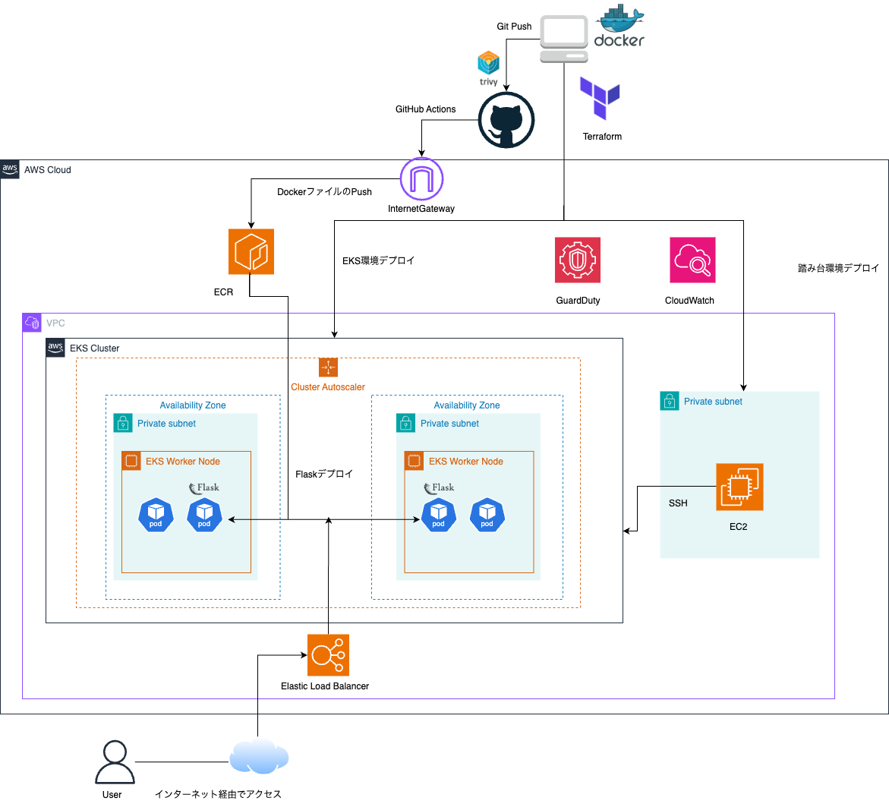
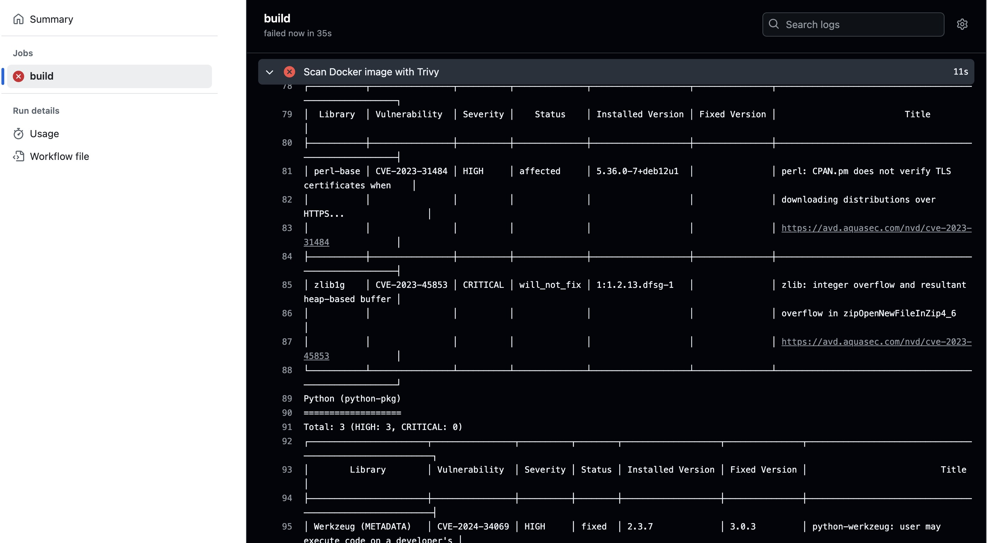
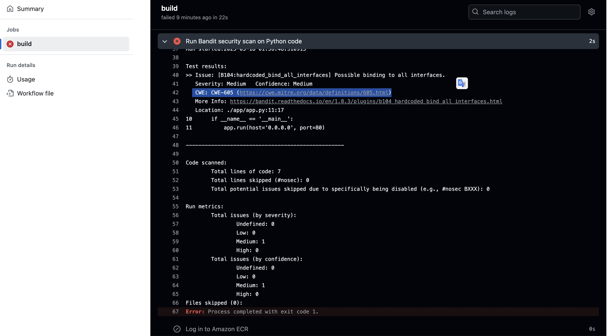
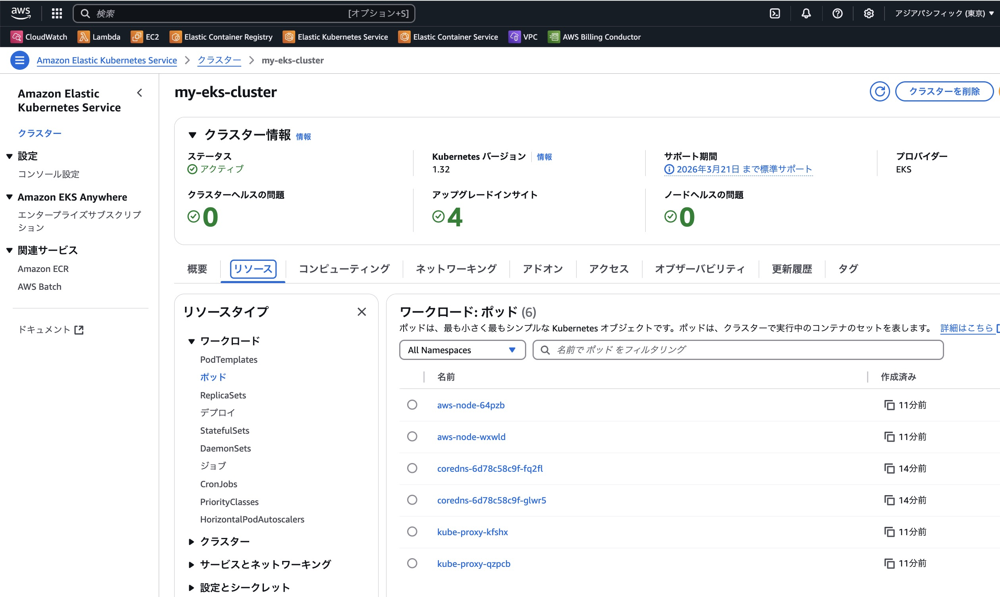
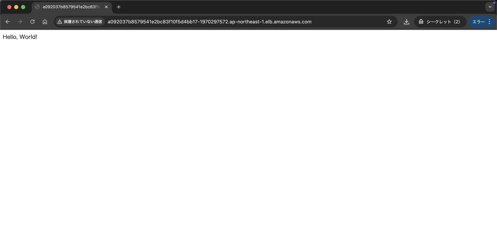

## 目次
- [1. はじめに](#1-はじめに)
  - [ポートフォリオの目的](#ポートフォリオの目的)
  - [作成した背景](#作成した背景)
- [2. プロジェクト概要](#2-プロジェクト概要)
  - [プロジェクトの目的・ゴール](#プロジェクトの目的・ゴール)
  - [想定ユースケース](#想定ユースケース)
  - [技術的な特徴](#技術的な特徴)
- [3. ディレクトリ構成](#3-ディレクトリ構成) 
- [4. システム構成図](#4-システム構成図)
- [5. 使用技術](#5-使用技術)
- [6. インフラの設計](#6-インフラの設計)
- [7. アプリケーションの実装](#7-アプリケーションの実装)
- [8. CI/CD パイプライン](#8-cicd-パイプライン)
- [9. セキュリティ対策](#9-セキュリティ対策)
- [10. モニタリングと運用](#10-モニタリングと運用)
- [11. デプロイ方法](#11-デプロイ方法)
- [12. 今後の展望・改善点](#12-今後の展望・改善点)
- [13. リンクリソース](#13-リンクリソース)

---

## **1. はじめに**

### **ポートフォリオの目的**

AWS EKSを活用したクラウドネイティブなアプリケーション設計・運用スキルの実証を目指して作成しました。本プロジェクトでは、特に以下の技術に重点を置いています。

- Kubernetes (EKS) の運用・管理
- Infrastructure as Code (Terraform)
- CI/CD (GitHub Actions)
- セキュリティ対策 (IAM, WAF, GuardDuty, Trivy)
- 監視・ロギング (CloudWatch)

これらの技術を組み合わせることで、セキュリティを重視した、インフラ構築の自動化を目指しました。

### **作成した背景**

DevSecOpsやSREのセキュリティ分野でのキャリアを目指し、インフラ自動化とCI/CDを活用したセキュリティ対策を勉強するため、Terraformを用いたAWS EKS環境の構築とGitHub Actionsを用いたデプロイの自動化に取り組みました。

---

## **2. プロジェクト概要**

### **プロジェクトの目的・ゴール**

AWS EKS上にFlaskアプリケーションをデプロイし、セキュアで高可用性のあるWebアプリケーションを構築します。本プロジェクトのゴールは以下の通りです。

- 高可用性を持ったWebアプリケーションの実装
- CI/CDパイプラインによる自動化されたデプロイ
- セキュリティ強化

### **想定ユースケース**

- WebアプリケーションのAPIサーバーとして利用
- 内部システムの連携先APIとして利用
- 複数のコンテナアプリケーションをEKSでスケーラブルにデプロイ

---

## 3. ディレクトリ構成

本プロジェクトのディレクトリ構成は以下の通りです。

```
.
├── app
│   ├── Dockerfile               # アプリケーションをコンテナ化するための設定ファイル
│   ├── app.py                   # アプリケーションのメインコード
│   ├── requirements.txt         
│   └── tests
│       └── test_app.py          # アプリケーションのテストコード
├── docs
│   └── images  #実行結果のスクリーンショット
├── infra
│   ├── environments
│   │   ├── dev
│   │   │   ├── main.tf          # Terraformによるインフラのメイン設定（開発環境）
│   │   │   ├── outputs.tf       
│   │   │   └── variables.tf    
│   │   └── prod                 # 本番環境の設定（今後利用予定）
│   └── modules
│       ├── ci_cd
│       │   └── k8s
│       │       ├── deployment.yaml  # Kubernetesのデプロイメント設定
│       │       └── service.yaml     # Kubernetesのサービス設定
│       ├── compute
│       │   ├── ec2.tf             
│       │   ├── eks
│       │   │   ├── eks_cluster.tf # EKSクラスターの設定
│       │   │   ├── eks_node_group.tf  # EKSノードグループの設定
│       │   │   ├── eks_node_role.tf  # EKSノードのIAMロール設定
│       │   │   └── variables.tf 
│       │   └── variables.tf       
│       ├── database               # データベースの設定（今後利用予定）
│       ├── monitoring             # モニタリング関連の設定（今後利用予定）
│       ├── networking
│       │   ├── variables.tf   
│       │   └── vpc.tf             # VPCの設定
│       └── security
│           ├── guardduty.tf       # GuardDutyの設定
│           ├── sec_group.tf       # セキュリティグループの設定
│           ├── variables.tf       
│           └── waf.tf             # AWS WAF（ウェブアプリケーションファイアウォール）の設定
├── .gitignore                   
├── .trivyignore                 # Trivyでスキャン対象から除外するファイルを指定する設定ファイル
├── .github
│   └── workflows
│       └── deploy.yml           # CI/CDのデプロイメント設定ファイル
└── readme.md                     
```

---

## **4. システム構成図**

本プロジェクトのシステム構成図は以下の通りです。


---

## **5. 使用技術**

### **インフラ**

- **AWS:** EKS, VPC, EC2, IAM
- **Terraform:** インフラのコード化

### **開発言語**

- **Python:** Flaskを用いたWebアプリケーションの実装
- **Shell Script:** スクリプトによる自動化タスク

### **CI/CD**

- **GitHub Actions:** 自動化されたCI/CDパイプライン

### **コンテナ**

- **Docker:** コンテナ化されたアプリケーション
- **Kubernetes:** EKSでのアプリケーション管理

### **監視・ロギング**

- **CloudWatch:** リソース監視とログの集約

### **セキュリティ対策**

- **IAM:** ユーザー・サービスに対する最小権限の付与
- **AWS WAF:** Webアプリケーションファイアウォールによる攻撃防止
- **Trivy:** コンテナの脆弱性スキャンツール
- **Bandit:** Pythonコードのセキュリティスキャン

---

## **6. インフラの設計**

### **インフラの基本設計**

- **AWS EKS (Elastic Kubernetes Service):** アプリケーションはEKS上で動作し、コンテナ化されたFlaskアプリケーションを管理します。
- **VPCとサブネット:** EKSをホストするために専用のVPCを作成し、必要なサブネットやセキュリティグループを定義します。
- **セキュリティ設定:** IAMポリシーやセキュリティグループを用いて、最小権限の原則に基づいたアクセス制御を行います。
- **Terraform:** インフラのコード化にはTerraformを利用し、再利用可能でスケーラブルな環境を構築します。

---

## **7. アプリケーションの実装**

Flaskを用いたシンプルなWebアプリケーションをEKS上にデプロイします。以下にコード例を示します。

```python
# app.py
from flask import Flask

app = Flask(__name__)

@app.route('/')
def hello_world():
    return 'Hello, World!'

if __name__ == '__main__':
    app.run(host='0.0.0.0', port=80)
```

アプリケーションは、外部リクエストを受け付けるAPIサーバーとして動作します。このコードはDockerコンテナ内で実行され、EKS環境にデプロイされます。

---

## **8. CI/CD パイプライン**

### **GitHub Actions によるCI/CDフロー**

GitHub Actionsを利用して、コードの品質チェックからアプリケーションのデプロイまでを以下のプロセスを完全に自動化しています。

1. **コードの品質チェック**
   - **Lintチェック:** Flake8を使用して、コードスタイルを自動的に検証し、品質基準を満たさないコードを防ぎます。
   - **ユニットテスト:** pytestを使用して、Flaskアプリケーションの基本的な機能をテストします。

2. **ビルドとデプロイ**
   - 成功したテスト結果を元に、DockerイメージをECRにプッシュし、その後EKSにデプロイします。

---

## **9. セキュリティ対策**

1. **IAM（Identity and Access Management）による最小権限の原則**
   - **最小権限の付与**: AWS IAMを使用し、各サービスやユーザーに最小限の権限のみを付与。これにより、不正アクセスや過剰な権限によるリスクを低減します。

2. **CI/CDにおけるセキュリティ強化**
   - **セキュリティチェックの自動化**: GitHub Actionsを使用して、以下のセキュリティチェックを自動化しています：
     - **セキュリティスキャン**:
       - **Trivyによる脆弱性スキャン**: CI/CDパイプラインでTrivyを用いてDockerイメージの脆弱性スキャンを実施。これにより、コンテナイメージが本番環境にデプロイされる前に脆弱性を検出し、リスクを未然に防止します。
        ### Trivyの検出例
        
       - **Banditによるコードの脆弱性チェック**: Pythonコードのセキュリティリスクを検出するためにBanditを使用。これにより、静的解析を実施し、入力の検証不足や機密情報のハードコーディングなどの潜在的なセキュリティホールを早期に発見します。
        ### Banditの検出例
        

   - **ビルド停止**: セキュリティスキャンで脆弱性が見つかった場合、CI/CDパイプラインを停止し、脆弱なコードがデプロイされないようにします。

このように、GitHub Actionsを使用したCI/CDパイプライン全体でセキュリティを強化し、ECRへのプッシュやEKSへのデプロイをセキュアに実施できるようにしました。

---

## **10. モニタリングと運用**

### **CloudWatchによる監視**

AWS CloudWatchを使用して、EKSノードのリソース使用状況やアプリケーションの動作を監視しています。主な監視項目は以下の通りです。

- **CPU/メモリ使用率**: リソースの使用状況をモニタリングし、リソース不足が発生しないようにアラートを設定しています。
- **Podの異常終了**: 異常終了したPodを検出し、速やかに再起動するように設定しています。
- **ログの収集**: アプリケーションやEKSに関連するログをCloudWatch Logsに送信し、問題のトラブルシューティングを効率化しています。

> **注意**: エージェントのインストールは完了していますが、監視設定を構成する必要があります。設定を行うには、以下のコマンドを実行してください。

```babash
$ sudo /opt/aws/amazon-cloudwatch-agent/bin/amazon-cloudwatch-agent-config-wizard
```
---

## **11. デプロイ方法**

### **デプロイの流れ**

本プロジェクトでは、インフラの構築にTerraformとGitHub Actionsを使用しています。以下の手順で、EKSクラスタをセットアップし、Flaskアプリケーションをデプロイします。

1. **リポジトリのクローンと環境変数の設定**
   - 最初に、GitHubリポジトリを`git clone`でローカルにクローンします。
   - クローンしたリポジトリで、必要な環境変数を設定します。AWSの認証情報やEKS設定に必要な情報は、GitHubの**Secrets**に設定し、CI/CDパイプラインで環境変数として使用します。
   
     **AWS認証情報の設定方法:**
    ローカル環境でAWS CLIを使ってデプロイを行う場合、以下のコマンドでAWS認証情報を設定します。
      ```bash
      export AWS_ACCESS_KEY_ID="<your-access-key-id>"
      export AWS_SECRET_ACCESS_KEY="<your-secret-access-key>"
      ```

     **GitHub Secretsの設定方法:**
     1. GitHubリポジトリの「Settings」 > 「Secrets」 > 「New repository secret」から、新しいシークレットを追加します。
     2. 以下の環境変数を追加します：
        - `AWS_ACCESS_KEY_ID`：AWSのアクセスキーID
        - `AWS_SECRET_ACCESS_KEY`：AWSのシークレットアクセスキー
        - `AWS_ACCOUNT_ID`：AWSアカウントID (ハイフン無しの12桁)
        - `AWS_ECR_REPO`：ECRのリポジトリ名（事前にECRを作成してください）
        - `AWS_REGION`：AWSリージョン（ap-northeast-1）
        - `EKS_CLUSTER_NAME`：EKSクラスタ名（my-eks-cluster）

2. **インフラの構築**
   - 環境変数の設定後、Terraformを使用して以下のリソースを作成します:
     - **VPC**
     - **サブネット**
     - **インターネットGW**
     - **セキュリティグループ**
     - **EKSクラスタ**
     - **ノードグループ**

   - `infra/environments/dev/main.tf` で定義されたインフラを構築します。
   - 必要なリソース（VPC、EKSクラスタなど）が作成されます。

   **Terraformコマンド:**

```bash
terraform init
terraform plan
terraform apply
```   

### terraform planの出力例

```bash
% terraform plan
module.networking.aws_vpc.main: Refreshing state... [id=vpc-0a0c06aeaae43ca85]
module.networking.aws_internet_gateway.main: Refreshing state... [id=igw-0c64256b55eebea99]

Terraform used the selected providers to generate the following execution plan. Resource actions are indicated with the following symbols:
  + create
<= read (data resources)

Terraform will perform the following actions:

  # module.compute.aws_instance.app_server will be created
  + resource "aws_instance" "app_server" { ...省略... }

  # module.eks_cluster.aws_eks_cluster.app will be created
  + resource "aws_eks_cluster" "app" { ...省略... }

  # module.eks_cluster.aws_eks_node_group.app_node_group will be created
  + resource "aws_eks_node_group" "app_node_group" { ...省略... }

  # module.eks_cluster.aws_iam_role.eks_cluster_role will be created
  + resource "aws_iam_role" "eks_cluster_role" { ...省略... }

  # module.networking.aws_subnet.subnet will be created
  + resource "aws_subnet" "subnet" { ...省略... }

  # module.security.aws_security_group.allow_ssh will be created
  + resource "aws_security_group" "allow_ssh" { ...省略... }

Plan: 24 to add, 0 to change, 0 to destroy.

Changes to Outputs:
  + subnet_id_1 = (known after apply)
  + subnet_id_2 = "subnet-031829121c2824c66"
  + vpc_id = "vpc-0a0c06aeaae43ca85"
```

### EKSにポッドが立ち上がった成功例


3. **アプリケーションのビルドとデプロイ**
- ソースコードをGitHubに`push`すると、GitHub Actionsが自動で次の処理を行います:
  - **DockerイメージがECR** にプッシュされます。
  - **EKSクラスタ上にFlaskアプリケーション**がデプロイされます。

4. **アプリケーションへの接続**

EKS クラスターにデプロイしたアプリケーションへ接続するには、以下の手順を実行します。

**① kubeconfig の更新**
AWS CLI を使用して、EKS クラスターの `kubeconfig` を更新し、kubectl コマンドでアクセスできるようにします。  
```bash
aws eks --region ap-northeast-1 update-kubeconfig --name my-eks-cluster
```
成功すると、以下のようなメッセージが表示されます。
```bash
Updated context arn:aws:eks:ap-northeast-1:610458732978:cluster/my-eks-cluster in /Users/admin/.kube/config
```

**② Service の確認**
デプロイされたアプリケーションの ELB (Elastic Load Balancer) のアドレスを確認します。
```bash
kubectl get svc
```
出力例：
```bash
NAME                        TYPE           CLUSTER-IP       EXTERNAL-IP                                                                    PORT(S)        AGE
flask-hello-world-service   LoadBalancer   172.20.169.226   a092037b8579541e2bc83f10f5d4bb17-1970297572.ap-northeast-1.elb.amazonaws.com   80:30659/TCP   3m48s
kubernetes                  ClusterIP      172.20.0.1       <none>                                                                         443/TCP        16m
```
`EXTERNAL-IP` に表示される ELB のアドレスがアプリケーションの公開 URL となります。

**③ アクセス確認**
ブラウザで以下の URL にアクセスし、アプリケーションが正しく動作しているか確認します。
```
http://a092037b8579541e2bc83f10f5d4bb17-1970297572.ap-northeast-1.elb.amazonaws.com
```
正常に表示されれば、アプリケーションへの接続は成功です。 

### アクセス成功例


---

## **12. 今後の展望・改善点**

### **今後追加予定の機能**

- **セキュリティ強化:** AWS WAFのロードバランサーへの導入を通じて、アプリケーションの脅威検出能力を強化し、DDoS攻撃やSQLインジェクション、XSSなどから守る対策を講じます。

- **サービスメッシュの導入:** Istioを使用して、マイクロサービス間の通信の管理、トラフィックのルーティング、セキュリティ強化を行いたいと考えています。これにより、サービス間の通信の可視化、セキュリティ強化、トラフィック制御を効率化できます。

- **監視の拡充:** DatadogのAPMやログ管理機能を活用し、アプリケーションのパフォーマンスやインフラ状態をリアルタイム監視を実現する予定です。

### **改善点**

- **リファクタリング:** コード内で変数化されていない部分があるため、変数化を進め、コードの可読性とメンテナンス性を向上させたいと考えています。


---

## **13. 参考資料・リンク集**

以下のリンクは、参考にした記事です。

### **Terraform関連**
- [AWS CLIをHomebrewでインストールする](https://zenn.dev/akakuro/articles/30f570b8863bef)
- [TerraformでVPCを作成する方法（AWS）](https://qiita.com/kakita-yzrh/items/cccf954daaa3de59d370)  
- [TerraformでAWS EKSインフラを構築する](https://qiita.com/snow_easy/items/6376d00e9521383934cc)  

### **AWS EKS関連**

- [AWS EKS クラスタ作成方法](https://www.niandc.co.jp/tech/20230804_37557/)  
- [Terraformを使ってEKSを構築する](https://techblog.ap-com.co.jp/entry/2018/12/06/141104)  

### **Flaskアプリケーション関連**

- [FlaskアプリケーションをDockerでコンテナ化する方法](https://qiita.com/RyutoYoda/items/c260d3a1067ff853b18e)  

### CI/CD関連

- [GitHub ActionsでCI/CDパイプラインを設定する](https://qiita.com/FumiSOULs/items/43cd6fbf56ecd32e5b34)  
- [Github ActionsでEKSにコンテナをデプロイする](https://www.tsuchiya.blog/deploy-to-eks-by-github-actions/)  


### **セキュリティ関連**

- [Trivyでコンテナイメージの脆弱性スキャンを行う方法](https://tech-lab.sios.jp/archives/38680)  
- [CI Workflow Utilizando Github Actions. Parte 1 - SAST com Bandit](https://doretox.com/posts/ci-githubactions/)  
- [Amazon EKSベストプラクティスガイド (セキュリティ編)](https://dev.classmethod.jp/articles/decipher-amazon-eks-best-practices-guide-for-security-part1/)  

---

